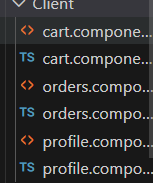

# 🍽️ Sistema de Delivery con Gestión de Menús

Sistema completo de delivery de comida con Angular 19, incluyendo gestión de restaurantes, productos y menús con relación intermedia.

**Generado con**: [Angular CLI](https://github.com/angular/angular-cli) version 20.3.10

---

## ⚡ Inicio Rápido

```bash
# Instalar dependencias
npm install

# Iniciar servidor de desarrollo
ng serve

# Abrir navegador en
http://localhost:4200
```

---

## 🎯 Características Principales

### ✅ Gestión de Menús (NUEVO - Diciembre 2025)

**Problema resuelto**: Sistema completo de menús sin necesidad de modificar el backend.

- **CRUD completo de menús** usando localStorage
- **Relación Restaurante ↔ Producto** mediante entidad intermedia Menu
- **Precios específicos** por restaurante para el mismo producto
- **Control de disponibilidad** por menú
- **Vista de administración** con edición inline
- **Vista de cliente** con productos del menú del restaurante

**Documentación completa**:
- 📖 `INICIO_RAPIDO.md` - Guía de inicio paso a paso
- 📖 `SISTEMA_MENUS_LOCALSTORAGE.md` - Documentación técnica completa
- 📖 `SOLUCION_COMPLETA.md` - Resumen de la implementación
- 🛠️ `public/inspector-menus.html` - Herramienta de inspección visual

### 🏪 Gestión de Restaurantes

- Crear, listar restaurantes
- Validaciones de datos (nombre solo letras, teléfono solo números, email válido)
- Interfaz de administración completa

### 🍕 Gestión de Productos

- Crear, listar productos
- Soporte para imágenes de productos
- Categorización
- Precios con validación de decimales

### 🗺️ Mapas y Ubicación

- Integración con Leaflet
- Visualización de ubicaciones de restaurantes

---

## AngularProyecto

## Development server

To start a local development server, run:

```bash
ng serve
```

Once the server is running, open your browser and navigate to `http://localhost:4200/`. The application will automatically reload whenever you modify any of the source files.

## Code scaffolding

Angular CLI includes powerful code scaffolding tools. To generate a new component, run:

```bash
ng generate component component-name
```

For a complete list of available schematics (such as `components`, `directives`, or `pipes`), run:

```bash
ng generate --help
```

## Building

To build the project run:

```bash
ng build
```

This will compile your project and store the build artifacts in the `dist/` directory. By default, the production build optimizes your application for performance and speed.

## Running unit tests

To execute unit tests with the [Karma](https://karma-runner.github.io) test runner, use the following command:

```bash
ng test
```

## Running end-to-end tests

For end-to-end (e2e) testing, run:

```bash
ng e2e
```

Angular CLI does not come with an end-to-end testing framework by default. You can choose one that suits your needs.

## Additional Resources

For more information on using the Angular CLI, including detailed command references, visit the [Angular CLI Overview and Command Reference](https://angular.dev/tools/cli) page.


## para que el chatbot funcione hay que poner en el terminal:

node src/app/infrastructure/gemini/gemini.js

no olvide instalar la dependencia: 

npm install express cors body-parser @google/generative-ai.

Todo lo que agregue esta en:

--components
  --Chat
  --Header

--Infrastructure
  --Gemini  

* app.ts (agregue los componentes creados HeaderComponent)  

## Jarvy creo el navbar (header con boton de chat, chat funcinando, icono listo para mostar la imagen de perfil del usuario una vez ingrese, Botón cerrar sesión) 

## Tarea Karen:

1. aplicar estilos (según lo tenga planeado en general) con:
header.Component.css
chat.component.css

2. Decidir si quiere el botón de cerrar sesión en el Header o sidebar


# 24/11/2025

Mapa ANDREs requiere correr los siguientes 
comandos:

npm install leaflet
npm install --save-dev @types/leaflet

enviorinment va sin /api

se crearon los services y models necesarios para todo lo relacionado con Cliente:
/core
 /services
  address.service
  order.service
  product.service
  customer.service
 /models
  address.model
  order.model
  product.model
  customer.model

## se crearon los componentes para cliente (carruto, orden y perfil)  
/shared
 /components
  /clients
   

la cual se consume en el layout: client-layout.component